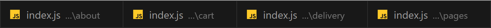
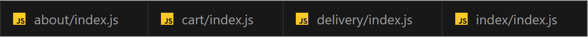

# VSCode Labels Templates

Are you tired of your tabs looking like this?

With [March 2024](https://code.visualstudio.com/updates/v1_88) update, VSCode introduced the [Custom labels for open editors](https://code.visualstudio.com/updates/v1_88#_custom-labels-for-open-editors) feature. This repo has a list a languages where this feature would be very beneficial.

_Feel free to contribute!_

## Currently added languages

- [NextJS](./configs/nextjs.json) - [official repo](https://github.com/vercel/next.js)
- [SvelteKit](./configs/sveltekit.json) - [official repo](https://github.com/sveltejs/kit)
